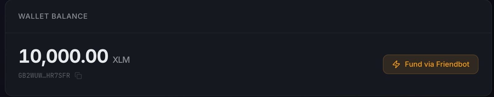
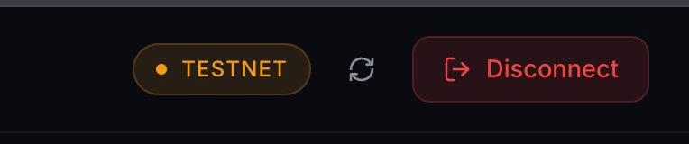
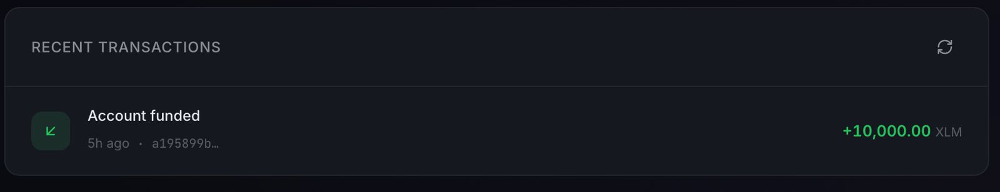

# StellarFlow — Testnet Wallet & Transaction Viewer

A lightweight dApp for the Stellar testnet. Connect your Freighter wallet, check your XLM balance, send payments, and browse your recent transaction history.

## Features

- **Wallet Connection** — Connect and disconnect your Freighter browser extension wallet.
- **Balance Display** — Real-time XLM balance for your connected account.
- **Friendbot Funding** — One-click testnet account funding via Stellar Friendbot.
- **Send XLM** — Build, sign (via Freighter), and submit payment transactions on testnet.
- **Transaction History** — View your 15 most recent transactions with direction, amounts, and links to Stellar Expert.

## Prerequisites

- [Node.js](https://nodejs.org/) v18+
- [Freighter Wallet](https://www.freighter.app/) browser extension installed and configured for **Stellar Testnet**

## Getting Started

```bash
# Install dependencies
npm install

# Start the dev server
npm run dev
```

Open the URL shown in your terminal (usually `http://localhost:5173`).

## Usage

1. Make sure Freighter is installed and set to the **Testnet** network.
2. Click **Connect Freighter** on the welcome screen.
3. If your account isn't funded yet, click **Fund via Friendbot** to receive 10,000 test XLM.
4. Use the **Send XLM** form to send a payment to any valid Stellar address.
5. Check the **Recent Transactions** section to see your history.

## Tech Stack

- **Vite** — Fast dev server and bundler
- **@stellar/stellar-sdk** — Stellar Horizon API client
- **@stellar/freighter-api** — Freighter wallet integration
- Vanilla JavaScript, HTML, CSS (no framework)

## Project Structure

```
├── index.html            # Entry HTML
├── vite.config.js        # Vite config with Node polyfills
├── src/
│   ├── main.js           # App entry — state, rendering, events
│   ├── stellar.js        # Stellar SDK + Freighter service layer
│   ├── icons.js          # SVG icon definitions
│   └── style.css         # Full design system
└── public/
    └── favicon.svg       # App favicon

```

## Screenshots

Wallet balance


Wallet State


Transaction history



## License

MIT
